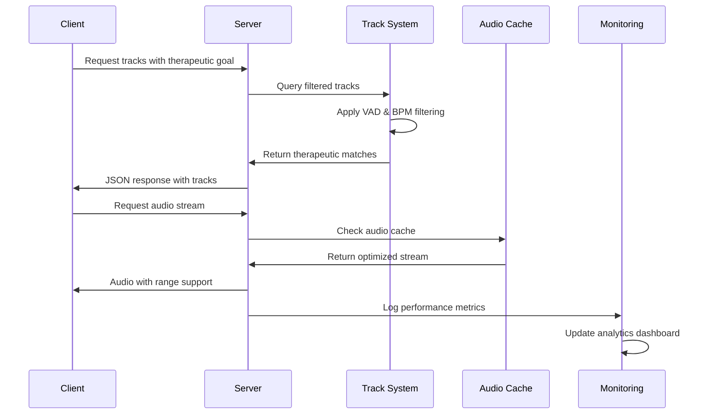

# NeuroTunes AI + System Architecture

## Architecture Overview

File-based therapeutic music platform with real-time streaming and neuroscience targeting.

### Core Components

```
Centralized Track System Architecture:
┌─────────────────────────────────────────┐
│          File System Catalog           │
├─────────────────────────────────────────┤
│  attached_assets/                       │
│  ├── *.mp3 (3,648 therapeutic tracks)   │
│  ├── Metadata encoded in filenames     │
│  └── VAD psychological scoring          │
├─────────────────────────────────────────┤
│       Memory-Based Track Cache          │
│  ├── Real-time track loading           │
│  ├── Instant filtering & search        │
│  └── Sub-100ms response times          │
├─────────────────────────────────────────┤
│      Therapeutic Classification         │
│  ├── Focus (302 tracks)                │
│  ├── Classical, New Age, & Acoustic    │
│  ├── Electronic, EDM, Rock, & Pop      │
│  └── Lightning feedback system         │
└─────────────────────────────────────────┘
```

### 2. Audio Streaming Architecture

Optimized audio delivery with advanced caching and streaming capabilities:

```
Audio Streaming Pipeline:
┌─────────────────────────────────────────┐
│           Client Request                │
├─────────────────────────────────────────┤
│    Session-based Authentication         │
├─────────────────────────────────────────┤
│        Audio Protection Layer           │
│  ├── Stream-only access                │
│  ├── No download capability            │
│  └── Rate limiting                     │
├─────────────────────────────────────────┤
│      Server-Side Audio Caching         │
│  ├── HTTP optimization headers         │
│  ├── Range request support             │
│  └── Efficient file serving            │
├─────────────────────────────────────────┤
│         Optimized Delivery              │
│  ├── MP3 streaming with headers        │
│  ├── Progressive loading               │
│  └── Error recovery mechanisms         │
└─────────────────────────────────────────┘
```

## System Components

### Frontend Architecture

**Single-Page Application (SPA)**
- `adaptive-music-app.html` - Complete therapeutic music interface
- Responsive design with mobile-first approach
- Progressive Web App (PWA) capabilities
- Touch-optimized controls with haptic feedback

**Core Frontend Features:**
```html
<!-- Main application structure -->
<div id="neurotunes-app">
  ├── Header with therapeutic goal selection
  ├── Genre filtering interface
  ├── Audio player with streaming controls
  ├── Track discovery and favorites system
  ├── Real-time analytics dashboard
  └── Debug panel (Ctrl+Shift+D)
</div>
```

**JavaScript Architecture:**
```javascript
// Modular component system
NeuroTunesApp = {
  audioPlayer: AudioPlayerManager,
  trackSystem: TrackDiscoverySystem,
  userSession: SessionManager,
  monitoring: MonitoringSystem,
  analytics: AnalyticsEngine,
  debugPanel: DebugInterface
};
```

### Backend Architecture

**Node.js/Express Server (`server/index.ts`)**
- TypeScript-based server with ES modules
- RESTful API with comprehensive endpoints
- Session-based user management
- Real-time health monitoring

**Core Server Components:**
```typescript
// Primary server modules
├── centralized-track-system.ts    // Music catalog management
├── therapeutic-recommendation-engine.ts  // AI personalization
├── debug-monitoring.ts            // Health & performance monitoring
├── storage.ts                     // Data persistence layer
└── index.ts                       // Main server entry point
```

### Therapeutic Targeting Engine

**VAD-Based Psychological Profiling:**
```typescript
interface VADModel {
  valence: number;    // Emotional positivity (-1 to 1)
  arousal: number;    // Energy level (-1 to 1)
  dominance: number;  // Control/confidence (-1 to 1)
}

// Therapeutic applications
const therapeuticTargets = {
  focus_enhancement: {
    bpm: { min: 78, max: 100 },
    vad: { valence: [0.0, 0.7], arousal: [0.0, 0.5] },
    requirements: ["instrumental", "no_vocals", "focus_keyword"]
  },
  nsdr_deep_rest: {
    bpm: { min: 40, max: 60 },
    vad: { valence: [0.0, 0.5], arousal: [-1.0, -0.3] },
    requirements: ["classical_new_age_only", "ultra_slow"]
  }
};
```

**Advanced Classification System:**
```typescript
// 4-Genre Classification with strict rules
enum TherapeuticGenre {
  FOCUS = "Focus",                           // 302 tracks - cognitive enhancement
  CLASSICAL = "Classical, New Age, & Acoustic", // 572 tracks - relaxation
  ELECTRONIC = "Electronic, EDM, Rock, & Pop",  // 2,774 tracks - energy
}

// Focus track requirements (strictest validation)
const focusValidation = {
  filenamePattern: /focus.*focus/,  // "focus" before AND after semicolon
  bpmRange: [78, 100],              // Optimal cognitive BPM
  instrumentalScore: > 0.7,         // High instrumental requirement
  vocalRestriction: false           // No vocals preferred
};
```

## Data Flow Architecture

### Request Processing Pipeline



### Session Management Flow

```typescript
// Session-based user isolation
interface UserSession {
  sessionId: string;        // Unique session identifier
  created: Date;           // Session creation time
  lastActivity: Date;      // Last user interaction
  preferences: {
    lastGoal: TherapeuticGoal;
    lastGenre: Genre;
    favorites: number[];
  };
  analytics: {
    tracksPlayed: number;
    sessionDuration: number;
    skipRate: number;
  };
}

// Automatic session creation and management
const sessionManager = {
  createSession: () => generateUniqueSessionId(),
  validateSession: (sessionId) => checkSessionValidity(sessionId),
  updateActivity: (sessionId) => recordUserActivity(sessionId),
  cleanup: () => removeExpiredSessions()
};
```

## Monitoring & Analytics Architecture

### Comprehensive Monitoring System

**Sentry Error Tracking Integration:**
```typescript
// Backend error capture
import * as Sentry from '@sentry/node';

// Automatic error tracking with context
Sentry.captureException(error, {
  tags: {
    component: 'therapeutic-engine',
    goal: currentGoal
  },
  extra: {
    trackMetadata: sanitizedMetadata,
    userSession: anonymizedSession
  }
});
```

**LogRocket Session Recording:**
```javascript
// Frontend user journey tracking
LogRocket.init('project-id');

// Capture therapeutic interactions
LogRocket.captureMessage('Therapeutic goal selected', {
  goal: selectedGoal,
  tracks_available: trackCount,
  user_session_duration: sessionTime
});
```

**Real-Time Debug Panel:**
```javascript
// Debug panel accessible via Ctrl+Shift+D
const debugPanel = {
  systemHealth: () => fetchSystemMetrics(),
  audioPerformance: () => getAudioAnalytics(),
  sessionInfo: () => getUserSessionData(),
  errorLogs: () => getRecentErrors(),
  performanceMetrics: () => getResponseTimes()
};
```

### Health Monitoring Endpoints

```typescript
// Comprehensive health monitoring
app.get('/api/health', (req, res) => {
  res.json({
    status: 'healthy',
    service: 'NeuroTunes AI + Therapeutic Music Platform',
    timestamp: new Date().toISOString()
  });
});

app.get('/api/debug-status', async (req, res) => {
  const metrics = {
    uptime: process.uptime(),
    memory: process.memoryUsage(),
    tracks: await getTrackCounts(),
    sessions: getActiveSessionCount(),
    performance: getPerformanceMetrics()
  };
  res.json(metrics);
});
```

## Security Architecture

### Audio Protection System

```typescript
// Multi-layer audio protection
const audioProtection = {
  sessionValidation: (req) => validateUserSession(req),
  rateLimiting: (userId) => checkStreamingLimits(userId),
  downloadPrevention: (res) => setStreamOnlyHeaders(res),
  metadataProtection: (track) => sanitizeTrackMetadata(track)
};

// Secure audio streaming headers
const secureHeaders = {
  'Content-Type': 'audio/mpeg',
  'Content-Disposition': 'inline',
  'X-Content-Type-Options': 'nosniff',
  'Cache-Control': 'public, max-age=3600',
  'Accept-Ranges': 'bytes'
};
```

### Privacy-First Design

```typescript
// Anonymous session management
const privacyFeatures = {
  anonymousSessions: true,           // No personal data required
  sessionIsolation: true,            // Multi-user support without data mixing
  autoExpiration: 24 * 60 * 60 * 1000, // 24-hour session lifetime
  sanitizedLogging: true,            // Remove sensitive data from logs
  gdprCompliant: true                // Automatic data expiration
};
```

## Performance Optimization

### Caching Strategy

```typescript
// Multi-layer caching system
const cachingStrategy = {
  trackMetadata: {
    method: 'memory',
    duration: '10 minutes',
    invalidation: 'lightning-feedback'
  },
  audioFiles: {
    method: 'http-headers',
    duration: '1 hour',
    compression: 'none' // Audio files not compressed
  },
  genreLists: {
    method: 'memory',
    duration: '30 minutes',
    invalidation: 'manual'
  }
};
```

### Audio Streaming Optimization

```typescript
// Optimized audio delivery
const audioOptimization = {
  fileFormat: 'MP3',               // Web-compatible format
  bitrateTarget: '128kbps+',       // Quality threshold
  streamingMethod: 'progressive',   // Progressive download
  rangeSupport: true,              // HTTP range requests
  compressionHeaders: false,       // No compression for audio
  cacheStrategy: 'aggressive'      // 1-hour cache headers
};
```

## Scalability Architecture

### Horizontal Scaling Patterns

```typescript
// Stateless server design for scaling
const scalabilityFeatures = {
  statelessSessions: true,          // Session data in memory/external store
  fileBasedCatalog: true,          // No database dependency
  horizontalReady: true,           // Multiple server instances supported
  loadBalancerCompatible: true,    // Standard HTTP load balancing
  cacheSharing: 'redis-optional'   // Optional Redis for shared caching
};
```

### Database-Optional Architecture

```typescript
// File system as primary data source
const dataStrategy = {
  primaryStorage: 'file-system',    // 3,648 tracks in attached_assets/
  metadataEncoding: 'filename',     // VAD data encoded in filenames
  trackIndex: 'memory-cached',      // Fast in-memory track index
  userSessions: 'memory-store',     // Session-based user data
  analytics: 'optional-external'   // External analytics if configured
};
```

## Integration Architecture

### External Service Integration

```typescript
// Optional external services
const integrations = {
  errorTracking: {
    service: 'Sentry',
    required: false,
    configuration: 'VITE_SENTRY_DSN'
  },
  sessionRecording: {
    service: 'LogRocket',
    required: false,
    configuration: 'VITE_LOGROCKET_ID'
  },
  database: {
    service: 'PostgreSQL',
    required: false,
    fallback: 'file-system-only'
  }
};
```

### API Integration Patterns

```typescript
// RESTful API design
const apiArchitecture = {
  endpoints: {
    '/api/tracks': 'Track discovery with therapeutic filtering',
    '/api/audio/*': 'Secure audio streaming',
    '/api/favorites': 'User personalization',
    '/api/health': 'System health monitoring',
    '/api/debug-status': 'Comprehensive system metrics'
  },
  responseFormat: 'JSON',
  authentication: 'session-based',
  rateLimit: 'per-session',
  compression: 'gzip-enabled'
};
```

## Development Architecture

### TypeScript-First Development

```typescript
// Strict TypeScript configuration
interface DevelopmentStandards {
  strictMode: true;
  explicitTypes: true;
  errorHandling: 'comprehensive';
  testCoverage: '>90%';
  documentation: 'inline-required';
}

// Therapeutic type safety
interface TherapeuticTrack {
  id: number;
  title: string;
  genre: TherapeuticGenre;
  bpm: number;
  vad: VADModel;
  therapeuticUse: TherapeuticGoal[];
  isValidForFocus: boolean;
  audioFeatures: AudioAnalysisResult;
}
```

### Testing Architecture

```typescript
// Comprehensive testing strategy
const testingStrategy = {
  unitTesting: {
    framework: 'Jest',
    coverage: '>90%',
    focus: 'therapeutic-targeting-logic'
  },
  integrationTesting: {
    framework: 'Supertest',
    coverage: 'all-api-endpoints',
    focus: 'audio-streaming-performance'
  },
  e2eTesting: {
    framework: 'Playwright',
    coverage: 'critical-user-journeys',
    focus: 'therapeutic-goal-completion'
  }
};
```

## Deployment Architecture

### Multi-Environment Support

```typescript
// Environment-specific configurations
const deploymentTargets = {
  development: {
    platform: 'local',
    database: 'optional',
    monitoring: 'debug-panel-only',
    audioSource: 'attached_assets'
  },
  production: {
    platform: 'replit-autoscale',
    database: 'postgresql-optional',
    monitoring: 'sentry-logrocket',
    audioSource: 'cdn-optional'
  },
  containerized: {
    platform: 'docker',
    database: 'postgres-container',
    monitoring: 'external-services',
    audioSource: 'volume-mounted'
  }
};
```

### Cloud-Native Patterns

```typescript
// Cloud deployment readiness
const cloudFeatures = {
  twelveFactorApp: true,           // 12-factor app compliance
  environmentConfig: true,         // Environment variable configuration
  statelessDesign: true,           // Horizontal scaling ready
  healthChecks: true,              // Kubernetes/Docker health checks
  gracefulShutdown: true,          // Clean process termination
  observability: true              // Comprehensive monitoring/logging
};
```

This architecture provides a solid foundation for therapeutic music delivery with comprehensive monitoring, security, and scalability features while maintaining the flexibility to operate with or without external dependencies.